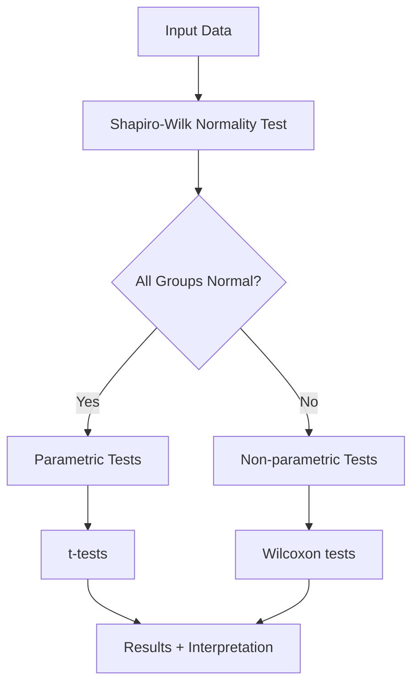

# simseR: Automated Statistical Testing with Normality Assessment

[](https://www.r-project.org/)
[](https://opensource.org/licenses/MIT)
[](https://github.com/brightboamah/simseR)
[](https://github.com/brightboamah/simseR)

> **Intelligent statistical testing that automatically selects appropriate parametric or non-parametric tests based on normality assessment**

## 📋 Table of Contents

- [Overview](#overview)
- [Key Features](#key-features)
- [Installation](#installation)
- [Quick Start](#quick-start)
- [Documentation](#documentation)
- [Examples](#examples)
- [Functions Reference](#functions-reference)
- [Statistical Methods](#statistical-methods)
- [Visualization](#visualization)
- [Reporting](#reporting)
- [Contributing](#contributing)
- [License](#license)
- [Citation](#citation)
- [Author](#author)

## 📊 Overview

**simseR** is an R package that revolutionizes statistical testing by automating the decision-making process between parametric and non-parametric tests. Instead of manually checking assumptions, simseR performs Shapiro-Wilk normality tests and intelligently selects the most appropriate statistical test for your data.

### 🎯 Why simseR?

- **🤖 Automated Decision Making**: No more guessing which test to use
- **📈 Professional Visualizations**: Publication-ready plots with base R graphics
- **📄 Comprehensive Reporting**: Generate HTML, PDF, and text reports automatically
- **🔧 Zero Dependencies**: Works with base R only - no external packages required
- **🎓 Educational**: Perfect for students and researchers learning statistical testing
- **⚡ Fast & Reliable**: Optimized for performance with robust error handling

## ✨ Key Features

### 🧠 Intelligent Test Selection
```r
# simseR automatically chooses the right test based on your data
result <- simseR_test(group1, group2)
# ✓ Normal data → t-test
# ✓ Non-normal data → Wilcoxon test
```

### 📊 Multiple Test Types
- **One-sample tests**: t-test vs Wilcoxon signed-rank
- **Two-sample tests**: t-test vs Wilcoxon rank-sum  
- **Paired tests**: Paired t-test vs Paired Wilcoxon

### 🎨 Professional Visualizations
- Normality assessment plots (histograms, Q-Q plots, boxplots)
- Test results visualization
- Comprehensive analysis dashboards
- All plots use base R graphics (no dependencies!)

### 📋 Automated Reporting
- **HTML reports** with professional CSS styling
- **PDF reports** with embedded plots
- **Text reports** for simple viewing
- **Markdown reports** for integration workflows

## 🚀 Installation

### Install from GitHub
```r
# Install devtools if you haven't already
install.packages("devtools")

# Install simseR from GitHub
devtools::install_github("brightboamah/simseR")
```

### Install from Package File
```r
# Download the package file and install
install.packages("path/to/simseR_v1.1.0.tar.gz", repos = NULL, type = "source")
```

### Load the Package
```r
library(simseR)
```

## ⚡ Quick Start

### Basic Usage
```r
library(simseR)

# Generate sample data
set.seed(123)
control_group <- rnorm(30, mean = 10, sd = 2)
treatment_group <- rnorm(30, mean = 12, sd = 2)

# Perform automated statistical testing
result <- simseR_test(control_group, treatment_group)

# View results
print(result)

# Create comprehensive visualization
plot(result)

# Generate professional report
simseR_report(result, "analysis_report.html", 
             title = "Treatment vs Control Analysis",
             author = "Your Name")
```

### One-Sample Test
```r
# Test if sample mean differs from hypothesized value
sample_data <- rnorm(25, mean = 5, sd = 1.5)
result <- simseR_test(sample_data, mu = 5)
print(result)
```

### Paired Test
```r
# Before/after comparison
before <- rnorm(20, mean = 75, sd = 8)
after <- before + rnorm(20, mean = 3, sd = 2)
result <- simseR_test(before, after, paired = TRUE)
summary(result)
```

## 📚 Documentation

### Function Arguments

#### `simseR_test()`
```r
simseR_test(x, y = NULL, mu = 0, alternative = "two.sided", 
           alpha = 0.05, conf.level = 0.95, paired = FALSE)
```

| Parameter | Description | Default |
|-----------|-------------|---------|
| `x` | Numeric vector (required) | - |
| `y` | Second group for two-sample tests | `NULL` |
| `mu` | Hypothesized mean for one-sample tests | `0` |
| `alternative` | Alternative hypothesis direction | `"two.sided"` |
| `alpha` | Significance level for normality testing | `0.05` |
| `conf.level` | Confidence level for the test | `0.95` |
| `paired` | Whether to perform paired test | `FALSE` |

## 💡 Examples

### Example 1: Clinical Trial Analysis
```r
# Simulate clinical trial data
set.seed(42)
placebo <- rnorm(50, mean = 120, sd = 15)    # Systolic BP
treatment <- rnorm(50, mean = 110, sd = 12)  # Lower BP with treatment

# Perform analysis
result <- simseR_test(placebo, treatment)

# Generate comprehensive report
simseR_report_pdf(result, "clinical_trial.pdf",
                 title = "Blood Pressure Treatment Efficacy",
                 author = "Dr. Bright Boamah",
                 include_data = TRUE,
                 include_plots = TRUE)
```

### Example 2: Quality Control
```r
# Manufacturing quality control
target_weight <- 100  # grams
sample_weights <- c(99.8, 100.2, 99.9, 100.1, 99.7, 100.3, 99.8, 100.0, 99.9, 100.2)

result <- simseR_test(sample_weights, mu = target_weight)

# Quick diagnostic plot
plot_diagnostic(result, save_plot = TRUE, filename = "qc_analysis.png")
```

### Example 3: A/B Testing
```r
# Website conversion rates
control_conversions <- rbinom(1000, 1, 0.12)   # 12% conversion
test_conversions <- rbinom(1000, 1, 0.15)      # 15% conversion

result <- simseR_test(control_conversions, test_conversions)

# Extract clean results for dashboard
clean_results <- extract_results(result)
print(clean_results)
```

### Example 4: Educational Research
```r
# Student test scores before and after intervention
student_ids <- 1:25
before_scores <- rnorm(25, mean = 75, sd = 10)
after_scores <- before_scores + rnorm(25, mean = 5, sd = 3)

result <- simseR_test(before_scores, after_scores, paired = TRUE)

# Create comprehensive analysis
plot_comprehensive(result, save_plot = TRUE, filename = "education_study.png")
simseR_report(result, "education_analysis.html",
             title = "Teaching Intervention Effectiveness",
             author = "Education Research Team")
```

## 🔧 Functions Reference

### Core Functions
| Function | Description |
|----------|-------------|
| `simseR_test()` | Main statistical testing function |
| `extract_results()` | Extract results as clean data frame |
| `summary()` | Display analysis summary |
| `print()` | Show detailed results |

### Plotting Functions
| Function | Description |
|----------|-------------|
| `plot_normality()` | Normality assessment plots |
| `plot_results()` | Test results visualization |
| `plot_comprehensive()` | Complete analysis dashboard |
| `plot_diagnostic()` | Quick diagnostic plots |
| `plot()` | S3 method for simseR objects |

### Reporting Functions
| Function | Description |
|----------|-------------|
| `simseR_report()` | Generate HTML/text/markdown reports |
| `simseR_report_pdf()` | Generate PDF reports with plots |

## 📈 Statistical Methods

### Test Selection Algorithm



### Supported Tests

| Scenario | Normal Data | Non-normal Data |
|----------|-------------|-----------------|
| One sample | One-sample t-test | Wilcoxon signed-rank |
| Two samples | Two-sample t-test | Wilcoxon rank-sum |
| Paired samples | Paired t-test | Paired Wilcoxon |

### Assumptions and Validation
- **Normality**: Assessed using Shapiro-Wilk test
- **Independence**: Assumed (user responsibility)
- **Equal variances**: Assumed for t-tests
- **Sample size**: Minimum 3 observations for normality testing

## 🎨 Visualization

### Plot Types

#### Normality Assessment
```r
plot_normality(result, save_plot = TRUE, filename = "normality_check.png")
```
- Histograms with normal curve overlay
- Q-Q plots for normality assessment
- Boxplots for outlier detection

#### Results Visualization
```r
plot_results(result, save_plot = TRUE, filename = "test_results.png")
```
- Group comparisons
- Density plots
- Test summary information

#### Comprehensive Dashboard
```r
plot_comprehensive(result, save_plot = TRUE, filename = "full_analysis.png")
```
- Combined normality and results plots
- Professional layout
- Publication-ready quality

## 📄 Reporting

### Report Formats

#### HTML Reports
```r
simseR_report(result, "analysis.html", 
             title = "Statistical Analysis",
             author = "Bright Boamah",
             include_data = TRUE)
```
- Professional CSS styling
- Interactive elements
- Embedded plots

#### PDF Reports
```r
simseR_report_pdf(result, "analysis.pdf",
                 title = "Statistical Analysis",
                 include_plots = TRUE,
                 include_data = TRUE)
```
- Publication-ready formatting
- Embedded high-quality plots
- Professional layout

### Report Contents
- **Executive Summary**: Key findings and significance
- **Data Overview**: Descriptive statistics
- **Normality Assessment**: Shapiro-Wilk test results
- **Statistical Test Results**: Complete test output
- **Interpretation**: Plain-language recommendations
- **Technical Details**: Methods and assumptions
- **Visualizations**: Embedded plots (when supported)

## 🤝 Contributing

Contributions are welcome! Please feel free to submit a Pull Request. For major changes, please open an issue first to discuss what you would like to change.

### Development Setup
```r
# Clone the repository
git clone https://github.com/brightboamah/simseR.git

# Install development dependencies
devtools::install_dev_deps()

# Run tests
devtools::test()
```

### Guidelines
- Follow R package development best practices
- Include tests for new functionality
- Update documentation for any changes
- Ensure backward compatibility

## 📝 License

This project is licensed under the MIT License - see the [LICENSE](LICENSE) file for details.

## 📖 Citation

If you use simseR in your research, please cite:

```bibtex
@software{boamah2024simseR,
  title = {simseR: Automated Statistical Testing with Normality Assessment},
  author = {Bright Boamah},
  year = {2024},
  version = {1.1.0},
  url = {https://github.com/Brig-Bayo/simseR}
}
```

## 👨‍💻 Author

**Bright Boamah**
- GitHub: [@brightboamah](https://github.com/Brig-Bayo)
- Email: briteboafo@icloud.com
- LinkedIn: [Bright Boamah](https://linkedin.com/in/brightboamah)

---

## 🌟 Support

If you find simseR helpful, please consider:
- ⭐ Starring this repository
- 🐛 Reporting bugs or requesting features
- 📢 Sharing with colleagues and students
- 💡 Contributing improvements

---

## 📊 Usage Statistics


---

**Made with ❤️ for the R community by Bright Boamah**

*Simplifying statistical testing, one analysis at a time.*

